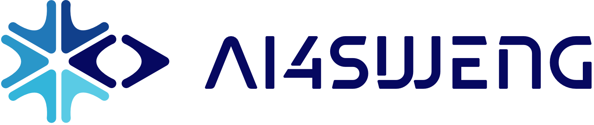

### AI Engineering Suite to support Agile Efficient Software Engineering

AI4SWEng is developing an AI toolset that transforms the complete software DevOps lifecycle — improving productivity, time-to-market, and the quality of software solutions across planning, development, and operations.

🌐 **Website:** [ai4sweng.eu](https://ai4sweng.eu)
💼 **LinkedIn:** [AI4SWEng](https://www.linkedin.com/company/106303143/)
📰 **Newsletter:** [Subscribe for updates](https://ai4sweng.eu/newsletter/)

---

## What we're building

Our research and development spans the full software engineering lifecycle:

- **Requirements engineering & architecture** — new approaches for using AI to identify requirements and derive system functionalities and architectures
- **AI-assisted coding** — tools for code generation, interactive refinement, cross-compilation, and advanced debugging, with ethical safeguards such as code origin and license checks
- **Testing & compliance** — test automation, energy efficiency measurement, and regulatory compliance in AI-driven software development
- **Real-world validation** — integrating our research through use cases in healthcare, cyber-physical systems, and EV energy management

## Consortium

AI4SWEng brings together 15 partners from across Europe and Switzerland, coordinated by **AI4SEC EU** (Estonia).

**Technical partners:** EURECOM, CEA, Libera Università di Bolzano, ITCL Technology Centre, IDRYMA TECHNOLOGIAS KAI EREVNAS, IDENER, University of Reading, BITNET, Innova Integra, HES-SO, ERGTECH Research, and Université de Genève.

**End-user partners:** ATPHARMA and Ergünler Group (Turkey).

See the full [consortium page](https://ai4sweng.eu/consortium/) for details.

## Funding

This project has received funding from the **European Union's Horizon Europe research and innovation programme** under grant agreement **No. 101189909**, with co-funding from the **Swiss State Secretariat for Education, Research and Innovation (SERI)**.

> Funded by the European Union. Views and opinions expressed are however those of the author(s) only and do not necessarily reflect those of the European Union or the granting authority. Neither the European Union nor the granting authority can be held responsible for them.

## Repositories

Our development repositories are currently private while the project is under active work. Public releases — tools, tutorials, best practices, and open deliverables — will be shared here as they become available.

## Get in touch

Have questions or want to collaborate? Reach out via our [contact form](https://ai4sweng.eu/contact-2/) or email us at **info@ai4sweng.eu**.
